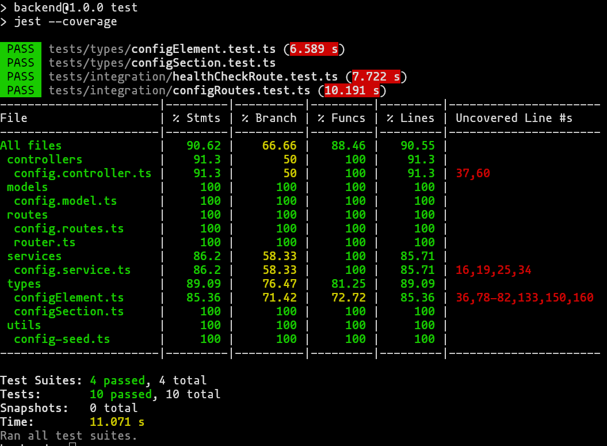

# Workshop e-commerce

## Setup

To configure the project, there are a couple steps that have to be achieved:

Create the `.env` files. There is one `.env` file in the root of the project, and one in `backend/`.

The `.env` file in the root:
```
MONGO_URI=mongodb://mongo:27017/database

FRONTEND_PORT=5173
VITE_PORT=8001
BACKEND_PORT=3000

MONGO_EXPRESS_PORT=27017
MONGO_EXPRESS_USER=username
MONGO_EXPRESS_PASSWORD=password
```

The `.env` file in the root:
```
MONGO_URI=mongodb://mongo:27017/database
PORT=3000
```

Because of inconsistencies that **will be fixed in an upcoming version**, you must not modify these values.

You can then run the project using the following command:
```bash
docker compose up --build
```

## The interesting stuff

There are 2 interesting pages that were developped:
- [The product page](http://localhost:5173/gameboy-advance-sp-personnaliser)
- [The configuration page](http://localhost:5173/admin)

### The code coverage

The code coverage is 90% for the back-end.


